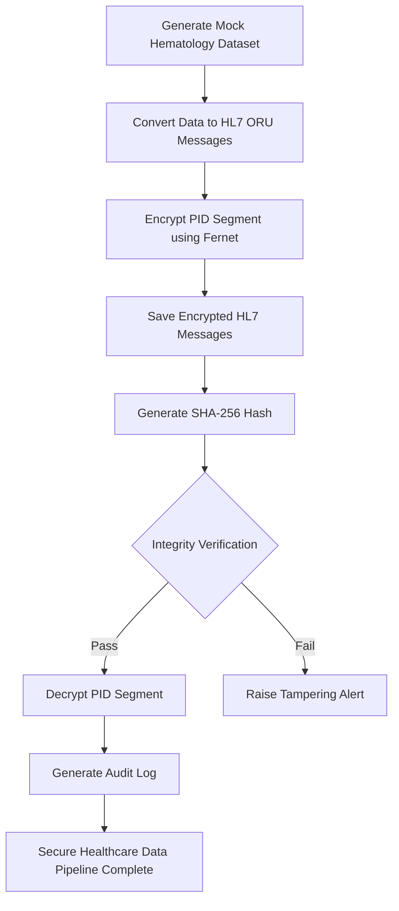
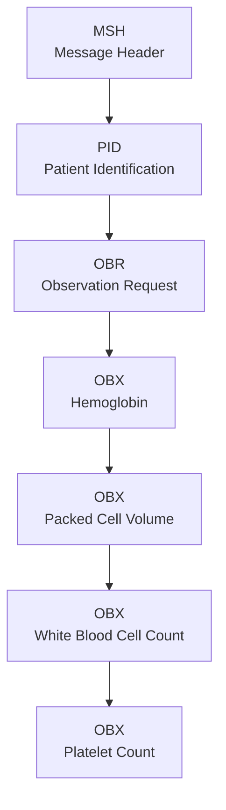

# Secure-HL7-Healthcare-Pipeline
Secure healthcare data pipeline demonstrating HL7 messaging, selective PID encryption, SHA-256 integrity verification, and audit logging using Python.

## Author
**Faith Ajila**
Medical Laboratory Scientist (In Training) | 
Health Data Security Enthusiast

# Project Background
Healthcare organizations exchange large volumes of laboratory information electronically. While laboratorry observations must remain available for clinical decision making, sensitive patient identifiers must be protected from unauthorized access or modification.
This project simulates a secure healthcare data exchange workflow by generating synthetic laboratory records, converting them into HL7 ORU messages, encrypting patient identifiers, verifying file integrity, and maintaining audit logs.

# Objectives
This project aims to:
- Generate realistic synthetic laboratory data.
- Convert laboratory data into HL7 messages.
- Protect Personally Identifiable Information (PII).
- Preserve clinical laboratory observations.
- Verify data integrity using SHA-256 hashing.
- Record security activities through audit logging.

# Technologies Used
- Python
- HL7 Messaging Standard
- Fernet Symmetric Encryption
- SHA-256 Hashing
- CSV
- Visual Studio Code

# Project Workflow


# Project structure
```text
secure-hl7-healthcare-pipeline/
│
├── mock_haematology_data.csv
├── hl7_builder.py
├── generate_key.py
├── encrypt_pid.py
├── decrypt_pid.py
├── generate_hash.py
├── verify_hash.py
├── audit_logger.py
├── hl7_messages.txt
├── encrypted_hl7_messages.txt
├── decrypted_hl7_messages.txt
├── encrypted_hash.txt
├── audit_log.txt
├── README.md
├── LICENSE
└── .gitignore
```

# HL7 structure

# Project Report
[Secure HL7 Healthcare Data Pipeline with Encryption.docx](https://github.com/user-attachments/files/29395407/Secure.HL7.Healthcare.Data.Pipeline.with.Encryption.docx)


# Security Features
### Confidentiality
Patient identifiers contained in the PID segment are encrypted using Fernet symmetric encryption.

### Integrity
SHA-256 hashing verifies that encrypted healthcare records have not been modified.

### Accountability
Audit logs record encryption, decryption, and integrity verification activities.

# Results
The project successfully:
- Generated 100 synthetic haematology patient records.
- Produced HL7 laboratory messages.
- Encrypted all patient identifiers.
- Decrypted all encryptedd identifiers.
- Logged all major security events.

# Learning Outcomes
Through this project, I strengthened my understanding of HL7 messaging, healthcare cybersecurity, selective encryption of patient identifiers, integrity verification using SHA-256, audit logging, and workflow automation using Python. The project also improvedmy debugging amd problem solving skills while reinforcing the importance of protecting sensitive healthcare information. 


# Future Improvements
- Role-Based Access Control
- Digital Signatures
- Database Integration

# NB:
This projecr uses synthetic laboratory data generated solely for educational and portfolio purposes. No real patient information was used.

# Connect with me
If you are interested in healthcare cybersecurity, laboratory information systems or health data analytics, I would be happy to connect and discuss opportunities for collaboration.
### GitHub: https://github.com/Funmilayo-Faith
### LinkedIn: www.linkedin.com/in/faith-ajila
